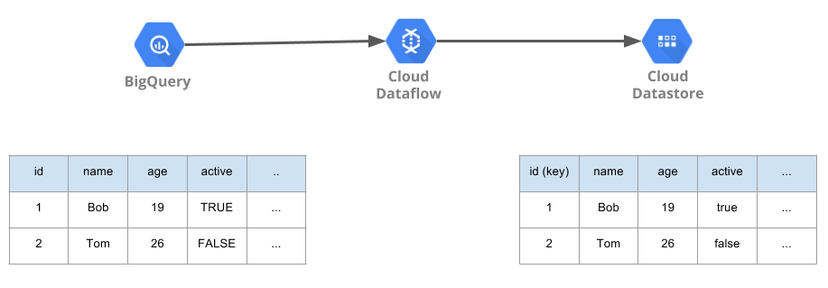

# `bigquery-to-datastore`

[](https://travis-ci.org/yu-iskw/bigquery-to-datastore)
[](https://codecov.io/gh/yu-iskw/bigquery-to-datastore)

This allows us to export a BigQuery table to a Google Datastore kind using Apache Beam on top of Google Dataflow.

You don't have to have duplicated rows whose key values are same.
Apache Beam's `DatastoreIO` doesn't allow us to write same key at once.



## Requirements

- Maven
- Java 1.8+
- Google Cloud Platform account

## Usage

### Required arguments
- `--project`: Google Cloud Project
- `--inputBigQueryDataset`: Input BigQuery dataset ID
- `--inputBigQueryTable`: Input BigQuery table ID
- `--keyColumn`: BigQuery column name for a key of Google Datastore kind
- `--outputDatastoreNamespace`: Output Google Datastore namespace
- `--outputDatastoreKind`: OUtput Google Datastore kind
- `--tempLocation`: The Cloud Storage path to use for temporary files. Must be a valid Cloud Storage URL, beginning with `gs://`.
- `--gcpTempLocation`: A GCS path for storing temporary files in GCP.

### Optional arguments
- `--runner`: Apache Beam runner.
  - When you don't set this option, it will run on your local machine, not Google Dataflow.
  - e.g. `DataflowRunner`
- `--parentPaths`: Output Google Datastore parent path(s)
  - e.g. `Parent1:p1,Parent2:p2` ==> `KEY('Parent1', 'p1', 'Parent2', 'p2')`
- `--indexedColumns`: Indexed columns on Google Datastore.
  - e.g. `col1,col2,col3` ==> `col1`, `col2` and `col2` are indexed on Google Datastore.
- `--numWorkers`: The number of workers when you run it on top of Google Dataflow.
- `--workerMachineType`: Google Dataflow worker instance type
  - e.g. `n1-standard-1`, `n1-standard-4`

### Example to run on Google Dataflow
```
# compile
mvn clean package

# Run bigquery-to-datastore via the compiled JAR file
java -cp $(pwd)/target/bigquery-to-datastore-bundled-0.6.0.jar \
  com.github.yuiskw.beam.BigQuery2Datastore \
  --project=your-gcp-project \
  --runner=DataflowRunner \
  --inputBigQueryDataset=test_dataset \
  --inputBigQueryTable=test_table \
  --outputDatastoreNamespace=test_namespace \
  --outputDatastoreKind=TestKind \
  --parentPaths=Parent1:p1,Parent2:p2 \
  --keyColumn=id \
  --indexedColumns=col1,col2,col3 \
  --tempLocation=gs://test_bucket/test-log/ \
  --gcpTempLocation=gs://test_bucket/test-log/
```

## How to run

### How to build and run it with java
```
# compile
mvn clean package
# or
make package

# run
java -cp $(pwd)/target/bigquery-to-datastore-bundled-0.6.0.jar --help
# or
./bin/bigquery-to-datastore --help
```

### How to run it on docker
We also offers docker images for this project in [yuiskw/bigquery\-to\-datastore \- Docker Hub](https://hub.docker.com/r/yuiskw/bigquery-to-datastore/).
We have several docker images based on Apache Beam versions.
```
docker run yuiskw/bigquery-to-datastore:0.6.0-beam-2.16.0 --help
```

### How to install it with homebrew
You can install it with homebrew from [yu-iskw/homebrew-bigquery-to-datastore](https://github.com/yu-iskw/homebrew-bigquery-to-datastore).
```
# install
brew install yu-iskw/bigquery-to-datastore/bigquery-to-datastore

# show help
./bin/bigquery-to-datastore --help
```

### Type conversions between BigQuery and Google Datastore
The below table describes the type conversions between BigQuery and Google Datastore.
Since Datastore unfortunately doesn't have any data type for time, `bigquery-to-datastore` ignore BigQuery columns whose data type are `TIME`.


| BigQuery | Datastore |
|---|---|
| BOOLEAN  | bool  |
| INTEGER  | int |
| DOUBLE  | double  |
| STRING  | string  |
| TIMESTAMP  | timestamp  |
| DATE  | timestamp  |
| TIME  | **ignored: Google Datastore doesn't have time type.**  |
| RECORD  | array  |
| STRUCT  | `Entity`  |

## Note
As you probably know, Google Datastore doesn't have any feature much like `UPDATE` of MySQL.
Since `DatastoreIO.Write` upsert given input entities, it will just overwrite an entity whether or not it already exists.
If we would like to insert multiple data separately, we have to combine them on bigquery beforehand.

## License
Copyright (c) 2017 Yu Ishikawa.
